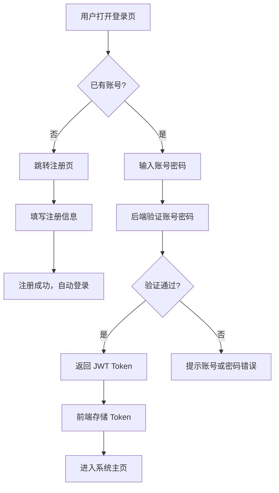
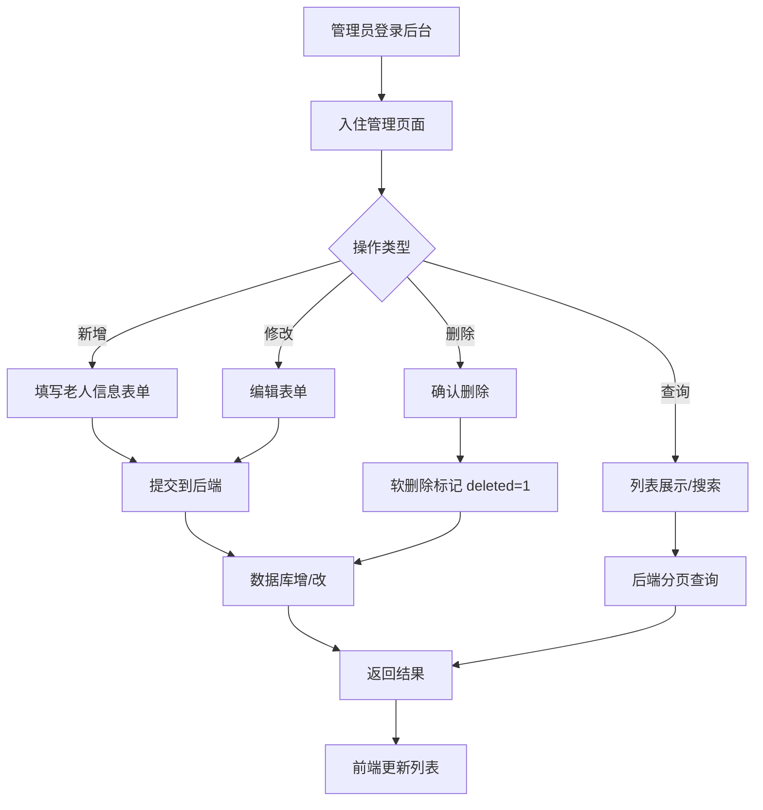
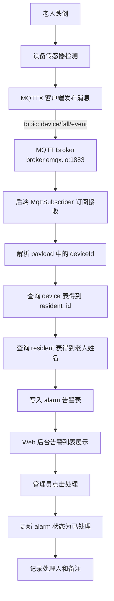

# 乐康养老系统 - 需求分析（5W1H）

## 一、项目背景

本项目为养老院管理系统实训作业，围绕"登录注册、入住登记管理、跌倒告警监测"三大功能点展开，模拟养老机构日常业务流程。

---

## 二、5W1H 分析

### Who（谁在用）

| 角色 | 说明 | 使用端 |
|------|------|--------|
| 管理员（ADMIN） | 养老院工作人员，负责入住登记、告警处理 | Web 后台 |
| 家属（FAMILY） | 老人家属，可查看老人信息和告警 | 小程序 |
| 老人（ELDER） | 入住老人，绑定设备后自动上报状态 | 小程序（预留） |
| 硬件设备 | 跌倒监测传感器，通过 MQTT 上报事件 | MQTT 客户端模拟 |

### What（做什么）

1. **登录注册**：管理员、家属可注册账号并登录系统
2. **入住登记管理**：对老人信息进行增删改查（姓名、性别、年龄、身份证、房间、床位、健康状况、家属信息、资料上传、入住流程）
3. **跌倒告警监测**：模拟硬件设备检测到老人跌倒，通过 MQTT 发送消息，后端接收后写入告警表，Web 后台展示并处理告警

### When（什么时候用）

- 老人入住时 → 登记信息
- 日常管理时 → 查询/修改/删除老人信息
- 老人跌倒时 → 设备自动上报 → 后台告警 → 工作人员处理

### Where（在哪里用）

- Web 后台管理：浏览器访问 `http://localhost:5173`
- 小程序：HBuilderX 运行（H5 模式或微信小程序）
- MQTT 设备模拟：MQTTX 客户端连接 `broker.emqx.io:1883`

### Why（为什么这样设计）

- **MQTT 协议**：IoT 设备通信标准，轻量、低带宽，适合传感器上报
- **JWT 鉴权**：无状态 Token，前后端分离架构标配
- **BCrypt 加密**：密码不可逆加密，安全合规
- **MyBatis-Plus**：简化 CRUD，减少样板代码
- **告警表冗余 resident_name**：读多写少场景，避免频繁 JOIN

### How（怎么做）

1. 管理员在 Web 后台登录
2. 录入老人入住信息（含设备绑定）
3. 硬件设备（MQTTX 模拟）检测到跌倒，发送 MQTT 消息
4. 后端 MQTT 订阅器接收消息，查询设备绑定的老人，写入告警表
5. Web 后台告警列表展示新告警，管理员点击处理
6. 家属可通过小程序查看老人信息和告警记录

---

## 三、业务流程图

### 3.1 登录注册流程

### 3.2 入住登记 CRUD 流程

### 3.3 跌倒告警流程（核心）

---

## 四、场景应用

### 场景一：新老人入住

张大爷入住养老院，管理员在后台录入其基本信息、健康状况、家属联系方式，并绑定跌倒监测设备 FALL-001。

### 场景二：老人跌倒告警

张大爷在房间跌倒，设备 FALL-001 通过 MQTT 上报跌倒事件。后端自动关联到张大爷，生成告警记录。后台弹出告警提示，管理员查看后前往现场处理，并在系统中标记"已处理"。

### 场景三：家属查看

家属通过小程序登录，可查看老人的基本信息和历史告警记录。

---

## 五、技术方案选择与对比

| 方案 | 优点 | 缺点 | 是否采用 |
|------|------|------|----------|
| Spring Boot + MyBatis-Plus | 成熟生态、CRUD 简单、与 Vue 配合好 | 启动较慢 | ✅ 采用 |
| Node.js + Express | 轻量、全栈 JS | 生态不如 Java 丰富 | ❌ |
| MQTT + Paho | IoT 标准协议、轻量 | 需要 Broker | ✅ 采用 |
| HTTP 轮询告警 | 实现简单 | 实时性差、浪费资源 | ❌ |
| JWT + Spring Security | 无状态、前后端分离标准 | 配置稍复杂 | ✅ 采用 |
| Session + Cookie | 简单 | 不适合前后端分离 | ❌ |
