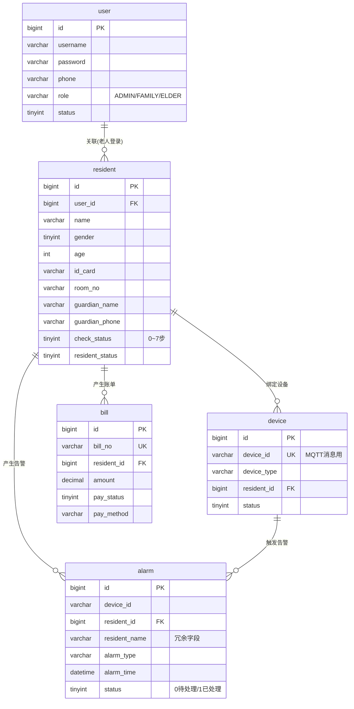

# 乐康养老系统 - 数据库设计说明

## 设计原则

1. **围绕功能**：三张核心表（user、resident、alarm）分别对应老师要求的三个功能点
2. **参考UI**：从UI截图中提取字段（如资料上传的三个图片字段、账单字段、7步入住流程）
3. **适度冗余**：告警表冗余 `resident_name` 避免频繁 JOIN，提升查询性能
4. **可扩展**：设备表预留 `device_type` 字段，未来可增加心率监测等设备类型

---

## 表清单与关联关系

---

## 各表详细说明

### 1. user 用户表 —— 支撑功能点①登录注册

| 字段 | 类型 | 说明 |
|------|------|------|
| id | BIGINT PK | 主键自增 |
| username | VARCHAR(50) UK | 登录账号，唯一 |
| password | VARCHAR(100) | BCrypt 加密存储 |
| phone | VARCHAR(20) | 手机号 |
| role | VARCHAR(20) | ADMIN管理员 / FAMILY家属 / ELDER老人 |
| status | TINYINT | 1正常 0禁用 |

**设计原因：**
- 三种角色共用一张表，简化鉴权逻辑；如果未来权限复杂度增加，可拆分为 user + role + user_role 三表
- 密码用 BCrypt（Spring Security 默认加密方式），不要明文存储

---

### 2. resident 老人入住登记表 —— 支撑功能点②入住CRUD

| 分类 | 字段 | 说明 |
|------|------|------|
| 基本信息 | name / gender / age / id_card / birthday | 老人身份信息 |
| 住宿信息 | room_no / bed_no / check_in_date | 房间床位 |
| 健康信息 | health_status | 慢性病/注意事项 |
| 家属信息 | guardian_name / guardian_phone / guardian_rel | 监护人联系方式 |
| **资料上传** | photo_one_inch / id_card_front / id_card_back | **来自UI截图** |
| **入住流程** | check_status (0~7) | **对应UI截图7步流程** |
| 状态 | resident_status | 1在住 0已退住 |

**设计原因：**
- `check_status` 用 tinyint 存 0~7，对应 UI 中 7 步入住流程的进度，便于前端步骤条高亮显示
- 资料上传字段存图片 URL，实际文件存本地或对象存储
- 预留 `user_id` 关联 user 表，方便家属/老人登录后查看自己信息

---

### 3. device 硬件设备表 —— 支撑功能点③MQTT告警

| 字段 | 说明 |
|------|------|
| device_id | **关键**，MQTT 消息中携带的设备编号，作为标识 |
| resident_id | 绑定的老人，收到 MQTT 消息后通过此字段找到是谁跌倒了 |

**设计原因：**
- MQTT 消息 payload 中包含 device_id，后端收到后查 device 表 → 得到 resident_id → 查 resident 表得到老人信息
- 这是消息链路的核心关联：**MQTT 消息 → device 表 → resident 表**

---

### 4. alarm 告警记录表 —— 支撑功能点③告警处理

| 字段 | 说明 |
|------|------|
| device_id | 来源设备 |
| resident_id | 关联老人 |
| resident_name | **冗余字段**，Web 后台列表展示时避免 JOIN resident 表 |
| status | 0待处理 / 1已处理 |
| handle_by / handle_remark | 处理人和备注 |

**设计原因：**
- 冗余 `resident_name` 是典型的读多写少场景下的反范式设计，告警列表高频读取，减少 JOIN 提升性能
- 处理状态用 tinyint 而非 status + handle_time 双字段，简单清晰

---

### 5. bill 账单表 —— 来自UI截图的首期缴费

| 字段 | 说明 |
|------|------|
| bill_no | 账单编号，如 ZD20241015000001 |
| amount | 账单金额，UI 中看到 50,000.00 元 |
| pay_status | 0待支付 1已支付 |
| pay_method | WECHAT / ALIPAY / OFFLINE |

**设计原因：**
- 账单编号格式参考 UI 截图：`ZD` + 日期 + 序列号
- 首期缴费只是第一步，未来可能有月度账单，所以加 `bill_type` 区分

---

## 三张核心功能表对应关系

| 老师要求的功能 | 核心表 | 关键接口 |
|----------------|--------|----------|
| ① 登录注册 | user | POST /api/auth/register, POST /api/auth/login |
| ② 入住登记CRUD | resident | GET/POST/PUT/DELETE /api/residents |
| ③ MQTT跌倒告警 | device + alarm | MQTT订阅 device/fall/# → 写入 alarm |

---

## 验收数据准备

执行 SQL 脚本后会自动生成以下测试数据：

| 类型 | 账号 | 密码 | 说明 |
|------|------|------|------|
| 管理员 | admin | 123456 | 后台管理登录 |
| 家属 | family01 | 123456 | 小程序登录 |
| 示例老人 | 张建国/李秀兰/王德福 | - | CRUD 测试 |
| 示例设备 | FALL-001/002/003 | - | MQTT 消息模拟 |

> 注：BCrypt 加密后的 `123456` 哈希值为 `$2a$10$N.zmdr9k7uOCQb376NoUnuTJ8iAt6Z5EHsM8lE9lBOsl7iKTVKIUi`，已写入 SQL 脚本中。
